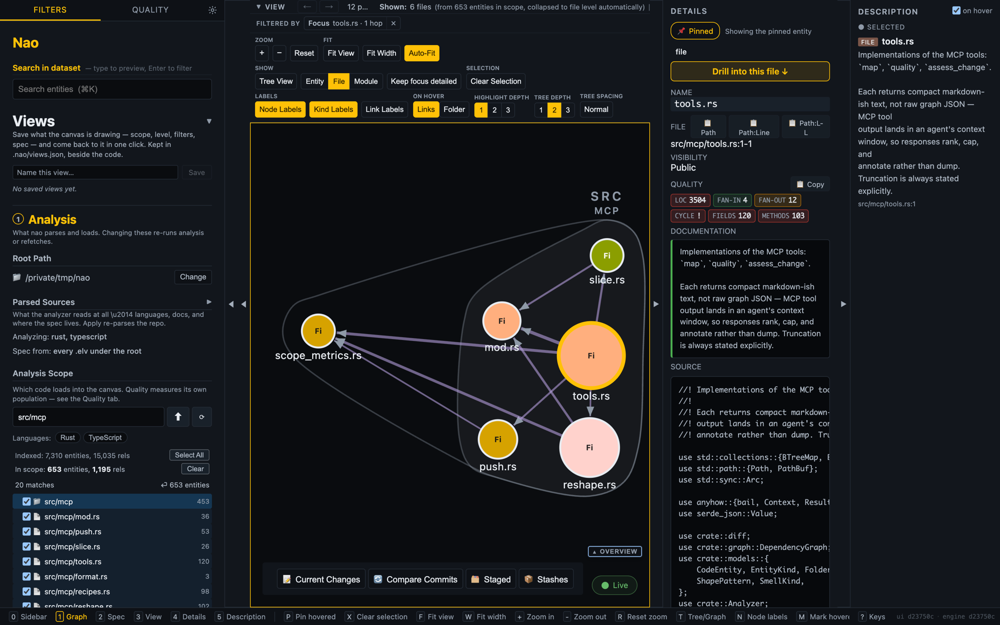
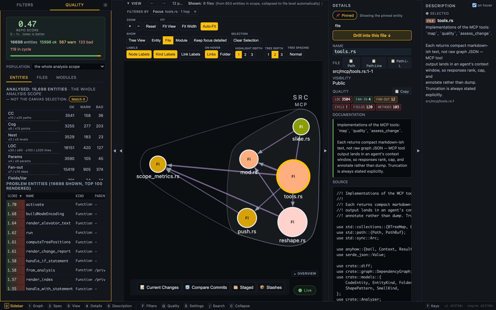

# Mezzanine

Interactive code visualizer and quality-metrics explorer for VS Code,
backed by a Rust analysis engine.

Existing tooling clusters at two extremes. LSP is precise but pointwise:
exact go-to-definition, one symbol at a time. Grep and reading are flexible
but structureless — text, not entities. Documentation is high-level but
stale. Mezzanine sits in the unoccupied middle: a holistic, structural view that
is always derived from the code as it is. That mid-altitude map is precisely
what does not fit in an agent's context window, and what a newcomer lacks
for their first weeks.



Pick any node and the panels answer for it: where it lives, what it depends
on, what depends on it, and every metric behind the badges.



The Quality tab measures the whole analysis scope rather than the canvas
selection, so the ranking answers "what in this repo most needs attention"
rather than "what am I looking at".

Project website: **[llvator.com](https://llvator.com)**

> **New here? Start with [guide/getting-started.md](guide/getting-started.md)** — a 5-minute install-and-run guide covering the `mezz` CLI, the `elevator` CLI, and the VS Code extension. The rest of this README is a feature reference.

> **Big picture:** [guide/capabilities-and-roadmap.md](guide/capabilities-and-roadmap.md) — what Mezzanine can do today (including the MCP tools for AI agents), how the pieces fit together, and where it's headed.

> **Working patterns:** [guide/workflows/](guide/workflows/) — what each surface is actually good at, split into [terminal](guide/workflows/cli/) workflows (the two CLIs and the MCP tools) and [visualizer](guide/workflows/web-ui/) workflows (the canvas).

## VS Code extension

The extension is the primary way to use Mezzanine. It adds a dedicated
activity-bar view with an interactive force-directed graph of your
codebase and bidirectional sync with the editor.

Install and rebuild instructions:
[vscode-extension/README.md](vscode-extension/README.md).

### Side panels

Each panel lives in the **Mezzanine** activity bar.

- **Visual Scopes** — checkbox tree controlling which files/folders
  appear in the graph.
- **Analysis Scope** — checkbox tree controlling which files/folders
  are analyzed (decoupled from display, so you can analyze the whole
  project while rendering a subset).
- **View Options** — aggregation level (entity / file / folder), tree
  depth and density, label toggles, zoom, and a **Follow selection**
  switch for bidirectional editor ↔ graph sync.
- **Filters** — by language and entity kind.
- **Selected Node Filters** — focused filters applied to the current
  selection.
- **Diff** — highlight what changed between two commits (uses `git`
  worktrees to compute a structural diff, not just a textual one).
- **Selection** — details for the selected entity (kind, location,
  metrics) with a **Go to Source** button.
- **Context** — the surrounding relationships of the selected entity.
- **Quality** — ranked list of entities with metrics and code-smell
  badges. Sortable by any of the metrics below.

### Quality metrics

Per entity (functions, methods, classes/structs, files):

- Cyclomatic complexity
- Cognitive complexity
- Working set (names in view: parameters + locals + `self`/`this` fields)
- Fan-in / fan-out
- Weighted Methods per Class (WMC)
- Dependency-chain depth
- PageRank (how "central" the entity is in the call/use graph)

### Code smells

- **God Class**
- **Dispatcher**
- **Feature Envy**
- **Shotgun Surgery**
- **Data Bag** (informational — flagged separately from the red smells
  since Kotlin `data class` and Python `@dataclass` are idiomatic uses
  of the same pattern).
- **Overfull Head** (working set over 12 — the only smell that does not
  depend on branching, so it catches the flat function that is hard to
  read because of how much it holds, not how much it decides).

### Commands

- **Mezzanine: Open Code Visualizer** — opens the full visualizer panel.
- **Mezzanine: Visualize Current File** — compact view focused on the entity
  at your cursor.

### Settings

- `mezz.binaryPath` — override the `mezz` binary location.
- `mezz.serverPort` — port for the internal mezz watch server
  (default `3200`).
- `mezz.includeTests` — include test files in the analysis.
- `mezz.includeDocs` — analyze Markdown documents alongside the code
  (see [Turning on the documentation layer](#turning-on-the-documentation-layer)).
- `mezz.autoVisualize` — automatically sync when switching files or
  moving the cursor.

## Supported languages

Seventeen languages have dedicated parsers. They differ in what they give you, so
the tiers below are by capability rather than by a first-class/fallback split.

**Full: entities, call edges, and exact `UsesType` edges from signatures and
fields** — this is the tier where `impact` is type-accurate.

| Language | Notes |
|---|---|
| Rust | Also the only language with an optional exact call-edge path (`MEZZ_LSP_EXACT=1`, via rust-analyzer) |
| Python | |
| TypeScript | |
| Java | |
| Go | Resolves a call through what the file declares — receiver to type, type to field, field to type — so `s.repo.Find()` reaches `Repository.Find` rather than a node named after the expression. `go` and `defer` edges are tagged with the keyword that scheduled them |
| Kotlin | |
| Dart | Full Dart 3 — class modifiers, records, patterns, extension types. Its grammar is vendored rather than pulled from crates.io; see `vendor/tree-sitter-dart/` |
| Groovy | Includes Spring bean and embedded-script handling. Only what the code declares: `def` is the absence of a type, so dynamically-typed members carry no edge |
| C++ / C | One parser for both — C++ is a superset of C for everything it reads, and `.h` belongs to both. Resolves a call through what the file declares, so `repo_->save()` reaches `Repository::save`; where the class body lives in a header this parse never saw, the receiver's own text is kept rather than guessed at. A `#define` is an entity, and a `SCREAMING_CASE` name read without being called is a dependency. `.h` is claimed by C, so narrow a C++ repo with `-l cpp,c` rather than `-l cpp` — an unnarrowed `mezz analyze .` reads both |
| Svelte | Component-level; much smaller in scope than the others |

**Entities and call edges, no type edges** — `impact` here approximates type
usage via "used via members".

| Language | Notes |
|---|---|
| JavaScript | Read by the TypeScript extractor — classes, private fields, async arrows and the calls between them all arrive. No `UsesType` edges: an untyped language states no types to draw them from. CommonJS `require` and `module.exports` are not yet in the import ledger, though a required name still resolves to what it names |
| Impex (SAP Hybris) | Hand-rolled parser; no tree-sitter grammar exists for the format |
| Ansible / Kubernetes | Topology-oriented: playbooks, roles, vars and templates, not individual tasks |
| Elevator (`.elv`) | The domain-spec language, not source code |
| SQL | Schema-oriented: tables and columns, with a foreign key drawn as the join it is — which key joins two tables, and how many rows sit at each end |
| Docker | Dockerfiles and Compose files read as one build-and-run topology — images, build stages and services, and what each one is built from or depends on. An entity cites the lines that define it |
| Markdown (`.md`) | Documents and the links between them, plus the source files they point at. **Opt-in** — see below |

### Turning on the documentation layer

Markdown is the one language mezz does not read by default. `.md` is everywhere
in a code repo — READMEs, ADRs, changelogs, issue trackers — and claiming it
unasked would add hundreds of nodes to every graph. Two ways to ask, answering
two different questions:

```sh
mezz analyze . --include-docs   # the normal analysis, plus its docs
mezz analyze . -l markdown      # the docs alone, as a pure note graph
mezz watch . --include-docs     # same, live
```

`--include-docs` **widens**; `-l` **restricts**, as it always does.

Every surface has the same switch:

| Surface | Control |
|---|---|
| CLI | `--include-docs` on `analyze` and `watch` |
| Browser UI / webview | **Include documentation**, in the Parsed Languages panel |
| VS Code | the `mezz.includeDocs` setting — then reload the window |

The extension spawns `mezz watch` for you, which is why a flag typed in a
terminal never reaches it. The in-panel switch takes effect on **Apply**
without a restart, and reports the server's real state on load rather than
assuming.

Ticking `markdown` in the language list works too, but it is a different
operation: the switch *adds* docs to whatever is selected, the checkbox
*restricts* to a set that contains them. Selecting only `markdown` is how you
get the pure note graph.

To leave it on for every surface at once, put it in the settings file:

```jsonc
// .mezz/settings.json  (repo)  or  ~/.config/mezz/settings.json  (user)
{ "include_docs": true }
```

A pinned `"language"` list does **not** override this. Asking for docs
explicitly beats a config file that never mentioned them.

Everything else — **including C#, C/C++, Ruby, Swift, Scala and PHP** —
falls back to a generic parser with reduced fidelity: entities but no
reliable relationships.

Call-edge accuracy is measured, not assumed: **93.7% recall at 98.6%
precision** against a rust-analyzer oracle on this repo. That is Rust-only;
see [Honest limitations](guide/capabilities-and-roadmap.md#honest-limitations)
for what it means in practice and what is *not* measured.

## CLI (secondary)

A `mezz` binary is installed as a prerequisite of the extension and can
also be used directly:

```bash
# Set a repo up: pin the languages it is written in, plus where the graph
# is written and which port serves it, in .mezz/settings.json
# (--vscode adds tasks that start, open and stop the browser UI; --mcp
#  registers the MCP server in .mcp.json; --all does both. --editor-tools
#  adds one task per graph tool, each scoped to the file open in VS Code)
mezz init ./my-project --all

# Serve an analysis with live reload (used by the extension)
mezz watch ./my-project --port 3200

# Watch the tree's quality as a live terminal dashboard — no browser, no port
# (every figure is a delta against the last commit; --baseline names another)
mezz monitor ./my-project

# Or hold both ends still and read the distance between two commits
mezz monitor ./my-project --baseline v0.4.0 --against HEAD

# One-shot JSON analysis
mezz analyze ./my-project -f json -o analysis.json

# Filter by language
mezz analyze ./my-project -l rust -l python

# Scope to a subtree / limit traversal depth
mezz analyze ./my-project -d 5

# Grade the tree against the rules the repo declared in .mezz/rules.json
# (exit 1 on a breach, 2 on a rules file mezz cannot use, --format json for CI)
mezz check ./my-project
```

### Declared rules

`mezz check` fails on the rules a project wrote down, and on nothing else —
mezz ships no rules of its own, so a repo without `.mezz/rules.json` passes and
says so ([ADR 0024](docs/adr/0024-a-check-fails-on-the-projects-rules-not-mezzs.md)).

```json
{
  "rules": {
    "max_entities_per_file": 7,
    "max_elements_per_entity": 7,
    "max_importers_per_file": 1,
    "max_entered_files_per_folder": 1,
    "max_middle_exits_per_folder": 0
  },
  "exempt": ["**/*.d.ts"]
}
```

The rules the [shape/](shape/) examples are built to hold, and each is a
count with the bar beside it:

- `max_entities_per_file` — what a reader meets on opening the file:
  declarations, not import statements, so a re-export shim is counted where
  the symbol is *declared*.
- `max_elements_per_entity` — the members of a class or interface, the
  parameters of a function.
- `max_importers_per_file` — how many other files depend on this one, counted
  against the file that declares what they use. A breach names every importer
  and the line it was written on, including the ones that arrived through a
  re-export and never typed the path.
- `max_entered_files_per_folder` — how many files in the folder anything
  outside it depends on: the doors and everything reached past them. `1` is
  "this folder has a single way in", and it is the rule to reach for if that
  is what you want.
- `max_middle_exits_per_folder` — how many files in the folder reach outside
  it from the folder's *middle*: a child that still depends on a sibling and
  also depends outward, so the level drawn above it is a fiction. Exits from a
  leaf or from the door are the shape a funnel has and are not counted. `0` is
  "this folder reaches outward only from its bottom", the outbound half of the
  rule above.
- `max_doors_per_folder` — how many files an outsider lands on *most*. Ties
  count: two files taking the same most traffic are two doors, and no
  tie-breaker is invented. Weaker than the rule above and less steady: a
  folder whose front door takes a quarter of the traffic arriving at it has
  one door and four other ways in, and one new dependency can break a tie and
  drop the count without the code changing shape. Declare it when you care
  about the busiest file specifically; otherwise prefer
  `max_entered_files_per_folder`.

`exempt` globs are matched against the path relative to the repo root. An
exempt file is reported apart from the passes, never among them, and is not
evidence against a file that is checked.

Every breach is reported (not one per folder) with the `file:line` to open —
a folder carries no line — and an unknown rule name, an unusable value or a
glob that does not compile is an error rather than a silent skip.

## Repo health

A snapshot of `src/` against the same complexity ceiling CI enforces (cyclomatic ≤ 15, cognitive ≤ 22, max nesting ≤ 4). Regenerated by `scripts/update_repo_health.py` and kept current by the pre-commit hook (install with `bash scripts/install_hooks.sh`).

<!-- generated by scripts/update_repo_health.py — do not edit by hand -->
<!-- repo-health:start -->
| Metric | Value |
|---|---|
| Source files (Rust) | 274 |
| Functions analyzed | 4520 |
| Functions above ceiling (grandfathered) | 97 |
| Cyclomatic complexity (p50 / p90 / max) | 2 / 7 / 33 |
| Cognitive complexity (p50 / p90 / max) | 1 / 8 / 129 |
| Max nesting depth (p50 / p90 / max) | 1 / 3 / 12 |
<!-- repo-health:end -->

## License

Mezzanine is dual-licensed:

- **[AGPL-3.0-only](LICENSE)** — free for everyone, and what you get by
  default.
- **[Commercial licence](COMMERCIAL.md)** — for organisations that cannot
  accept the AGPL, want to host Mezzanine as a service for third parties, or want
  to redistribute it inside a closed-source product.

Running Mezzanine is not distribution. Analysing your own code — proprietary code
included, across a whole company — triggers no AGPL obligation, so most users
need nothing beyond the AGPL. [COMMERCIAL.md](COMMERCIAL.md) sets out the
cases that do.

Contributions are covered by a [Contributor Licence Agreement](CLA.md), which
is what lets contributed code be offered under both licences. It is a licence
grant, not a copyright assignment: you keep ownership of what you write.
